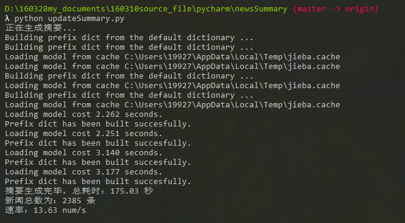

# newsSummary
基于textrank算法的中文摘要，此项目用于[新闻摘要平台][1]，截图所用数据来自该平台的[爬虫项目][2]。

example1.py的运行结果：
```plain
修订草案二审稿增加由市政府组织编制首都功能核心区、城市副中心控规的规定。而修订草案一审
稿只是提出，首都功能核心区、城市副中心的控制性详细规划由市规划国土行政主管部门会同所在
区人民政府组织编制
```


updateSummary.py的运行截图：



[1]:https://github.com/yonghuizhong/newsQQDjango
[2]:https://github.com/yonghuizhong/newsqq
